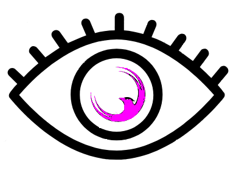
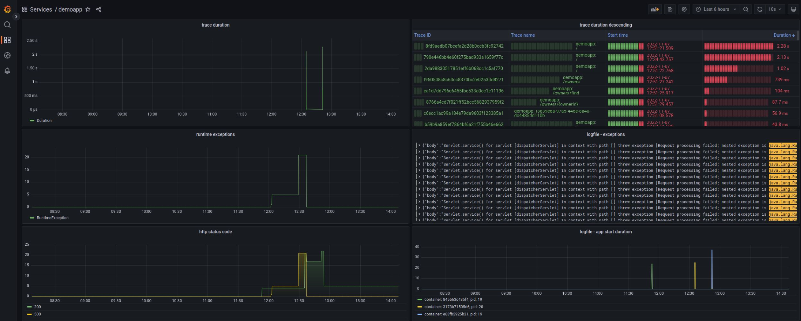

# F.E.M. : Falcon Eye Monitoring
Like a falcon, everything in sight! F.E.M. brings it all together: logfile, traces, metrics.

[F.E.M](#fem)  
- [Demo application](#demo-java-application-petclinic)  
- [DB Exporters](#db-exporters)  
- [Shell Exporter](#shell-exporter)  

[Known bugs and problems](Knownbugs.md)  


## Setup

### F.E.M

The following diagram illustrates the container setup using Jaeger-Tracing using an Opensearch backend.


#### Interfaces

| external Interface | Port | Description                                                                                   |
|---|---|-----------------------------------------------------------------------------------------------|
| GrafanaUI | 23000 | Provides direct access to grafana. Do not use in production. Please use TraefikHttps instead. |
| JaegerQueryUI | 26686 | Provides direct access to jaeger ui. Do not use in production.                                |
| LokiHttp | 23100 | Provides api accessto loki. Do not use in production.                                         |
| OtelAgentGrpc | 24318 | Secured endpoint to collect metrics, traces and logs from application.                        |
| PrometheusHttp | 29090 | Provides direct access to prometheus. Do not use in production.                               |
| TraefikDashboard | 28080 | Provides traefik dashboard. Do not use in production.                                         |
| TraefikHttp | 20080 | Provides unencrypted access to traefik http interface. Do not use in production.              |
| TraefikHttps | 20443 | Provides secured access to traefik https interface.                                           |

#### Configuration / Preparation

- To create the sample ssl certificates for the otel collector you use the `certs` makefile target.
  **For production use your own certificates**
- To prepare the configuration files, use `config` target.

`make --file Makefile.fem config certs`

#### Start

`make --file Makefile.fem start`

To access the grafana instance just navigate with your favorite browser to https://fem-grafana.localhost:20443.

#### Stop

`make --file Makefile.fem stop`


### Demo Java Application (Petclinic)

There is a simple petclinic demo application which can be used to test the F.E.M. setup.

If you are using your own application, 
you have to add the otel java agent as JVM parameter together with some configuration:

```
-javaagent:<path-to>/opentelemetry-javaagent.jar
-Dotel.exporter.otlp.endpoint=https://<monitoring-host>:4318 
-Dotel.exporter.otlp.certificate=<path-to>/server.crt 
-Dotel.resource.attributes=service.name=<name-of-the-service> 
-Dotel.metrics.exporter=otlp 
-Dotel.logs.exporter=otlp 
```

#### Start

`make --file Makefile.fem-demoapp start`

To start the demo application you have to start F.E.M. before.

The demo application is available under https://fem-demoapp.localhost:20443.

#### Stop

`make --file Makefile.fem-demoapp stop`


### DB Exporters

The following diagram illustrates the components used for database exporters. The exporter can be used together
with F.E.M. setup.

For now the following databases are supported:
- Postgresql
- MongoDB


#### Interfaces

| external Interface | Port | Description |
|---|---|---|
| Postgresql Port | 5432 |   |
| MongoDB Port | 27017 |   |
| PostgresqlHttp | 29216 | Provides direct access to the postgresql exporter. Do not use in production. |
| MongoDBHttp | 29187 | Provides direct access to the mongodb exporter. Do not use in production. |

#### Configuration / Preparation

- To prepare the configuration files, use `config` target for each supported db.

`make --file Makefile.fem-dbexporter config-mongodb`  
`make --file Makefile.fem-dbexporter config-postgresql`

#### Start

`make --file Makefile.fem-dbexporter start-mongodb`  
`make --file Makefile.fem-dbexporter start-postgresql`

#### Stop

`make --file Makefile.fem-dbexporter stop-mongodb`  
`make --file Makefile.fem-dbexporter stop-postgresql`

### Shell Exporter

The shellexporter is an application written in go. It executes scripts and exports the results as an prometheus endpoint.
The shellexporter can be used together with the F.E.M. setup. For detailed informations watch the project at:
https://github.com/dodopizza/prometheus-shell-exporter

For now the following shells are supported:
- bash / sh
- powershell


#### Interfaces

| external Interface | Port | Description |
|---|---|---|
| Prometheus Exporter Port | 9360 | Port for scraping metrics with prometheus  |

#### Start

`make --file Makefile.fem-shellexporter start`

#### Stop

`make --file Makefile.fem-shellexporter stop`

#### Scripts
Place your scripts into the folder $pwd/shellexporter/metrics. There you can find the "bash_gauge.sh" example as well.
The folder is read-only mounted to the container under /usr/local/shellexporter/metrics.

#### Security
Please notice that by design no encryption for transport and no authentication for the endpoint are implemented.
So if you plan to use this in production, you should consider using a https-proxy for terminate the sessions, e.g. as a side container.


### Description

#### Traces

* Otel-Agent configured as Java-Agent for every application to monitor
* Traces are exported to Otel-Collector
* Otel-Collector exports traces to Jaeger-Collector
* Jaeger-Query is used to query data stored by Jaeger-Collector
* Data is stored in Opensearch backend
  * Opensearch database stores data in filesystem

#### Metrics

* Prometheus grabs metrics from Otel-Collector
  * Prometheus stores data in filesystem

##### Database metrics

* There are exporters for each database which are connected to the database using tls.
* Each dbexporter provides a metrics endpoint

##### shellexporter metrics

* The shellexporter exports metrics from shell scripts and provide a metrics endpoint for prometheus.


#### Logs

* Logfiles are exported to Otel-Collector by the Otel-Agent
* Data is pushed to Loki which stores data in filesystem

#### Java application metrics

* Metrics, traces and logs are exported to Otel-Collector

#### Grafana

* Metrics, traces and logs can be analyzed using Grafana
* Grafana is beeing provisioned with basic datasources:
  * Prometheus for metrics
  * Loki for logs
  * jaeger for traces
* Grafana is beeing provisioned with basic dashboards
  * for the demoapp


